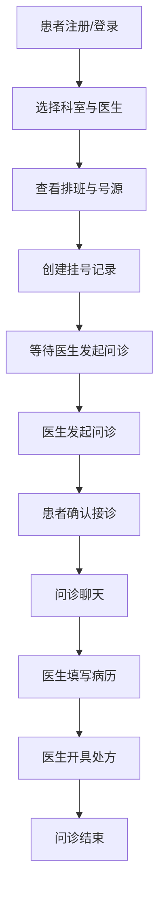
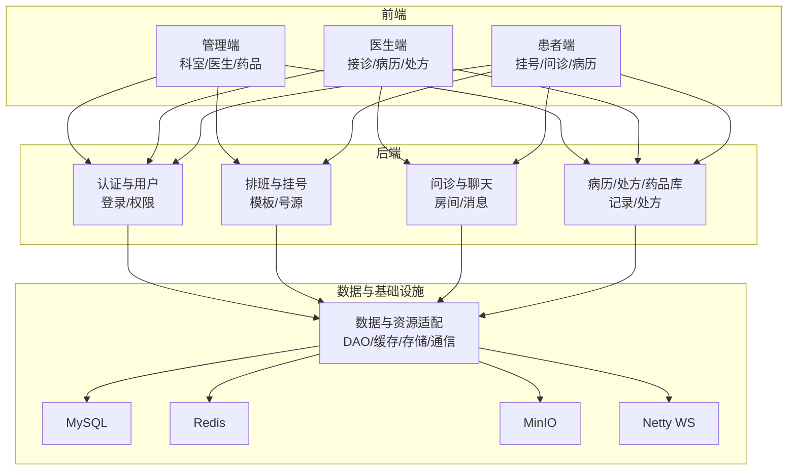
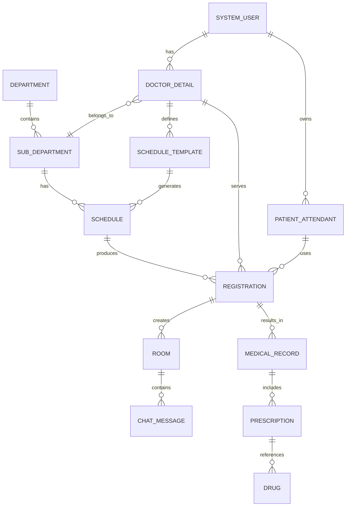
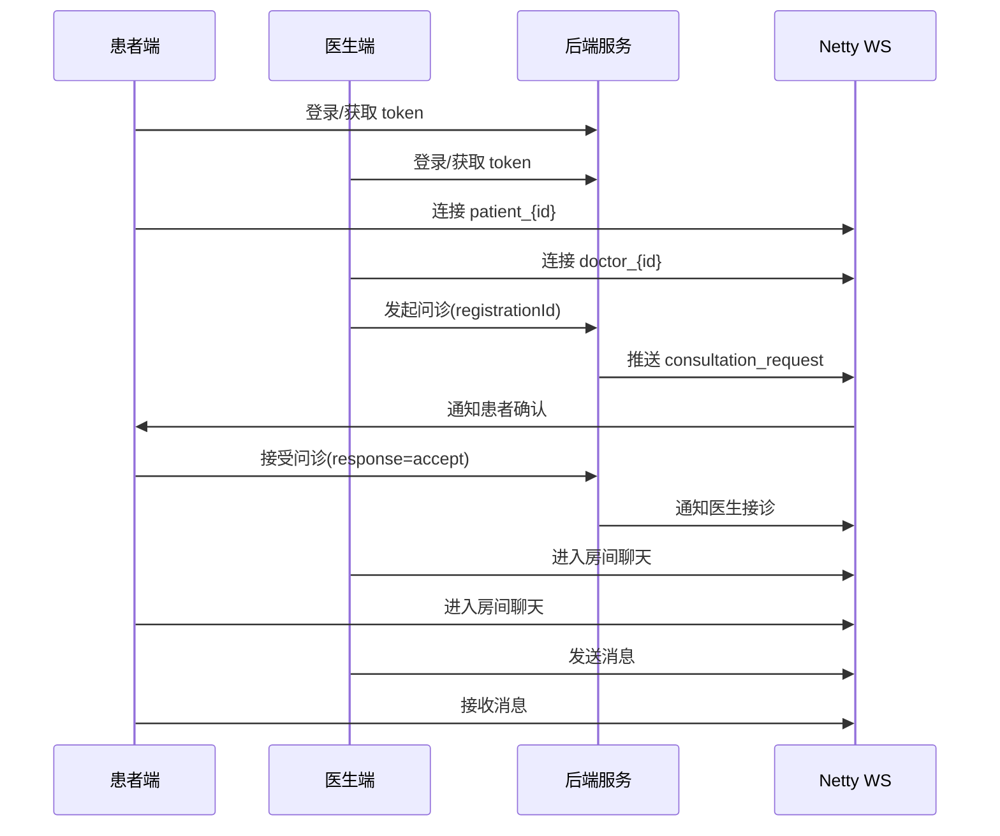

# 第一工期工作内容与图示（基建阶段）

## 工作内容（详细）
1) 需求边界与角色梳理  
- 明确三端角色：患者端、医生端、管理端；输出各端核心功能清单与责任边界。  
- 明确核心业务链路：挂号 → 问诊 → 病历/处方 → 完成/复盘（不包含在线购药/支付）。  

2) 关键业务模型创建与字段定义  
- SystemUser：账号、密码、角色、状态、邮箱/手机等登录与权限字段。  
- DoctorDetail：医生关联账号、科室、职称、简介、状态等基础信息字段。  
- PatientAttendant：就诊人姓名、身份证、性别、手机号、与账号的关联字段。  
- Department / SubDepartment：科室与子科室名称、描述、诊疗范围字段。  
- Schedule：排班日期、时段、号源总量、已挂号数、状态字段。  
- ScheduleTemplate：医生、周几、上午/下午号源、启用状态字段。  
- Registration：挂号单号、就诊人、医生、排班、状态、创建/更新时间字段。  
- Room：问诊房间、医生/患者、关联挂号、房间状态字段。  
- ChatMessage：房间、发送者、消息类型、内容、时间字段。  
- MedicalRecord：问诊记录、主诉、诊断、医嘱、医生、患者字段。  
- Prescription：处方与病历关联、药品项、用法用量字段。  
- Drug：药品名、规格、生产商、价格、库存字段。  

3) 核心流程说明与文档沉淀  
- 输出“挂号-问诊-处方”主流程说明文档。  
- 明确挂号状态码与房间状态码含义，作为前后端一致性依据。  
- 明确排班模板按周生成、并提供手动补偿生成入口用于宕机恢复。  

4) 工程化基础能力搭建  
- 创建后端工程与目录结构，配置统一返回体与异常处理机制。  
- 创建 JWT 工具与鉴权拦截器，打通 access-key 认证流程。  
- 创建 Redis 访问封装与基本缓存接口，支持后续状态与令牌存取。  

5) 登录注册与基础闭环打通  
- 后端实现：注册、登录、验证码、找回密码、用户信息获取接口。  
- 前端实现：登录/注册/找回密码页面与请求封装；完成 token 本地持久化与用户信息回填。  

6) 项目启动与联调基础  
- 形成本地启动步骤说明；确保后端与两套前端可启动并联调基础接口。  

## 图示

### 1. 核心业务流程图

### 2. 系统功能分层图

### 3. 核心实体关系图（概念级）

### 4. 登录与问诊交互时序图

