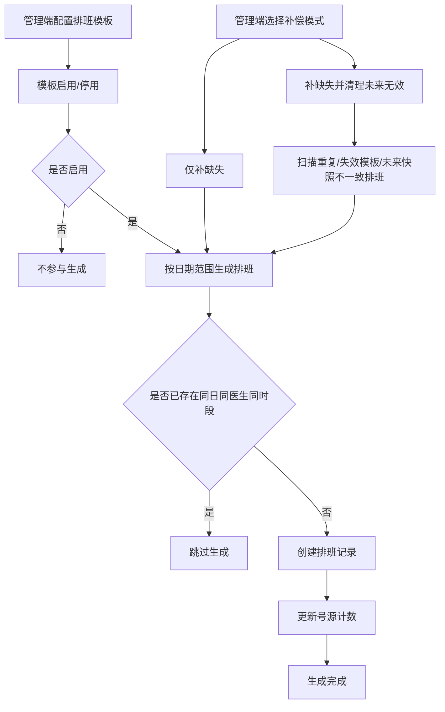
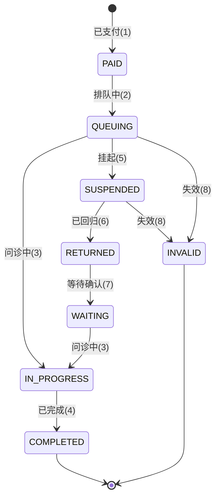
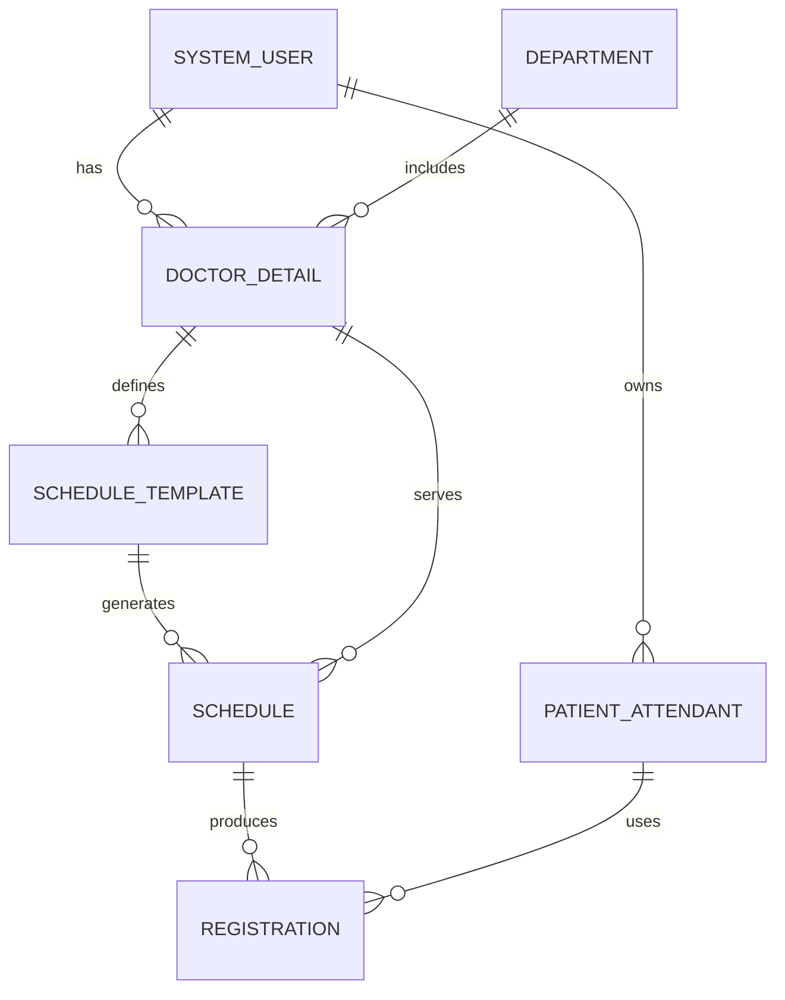
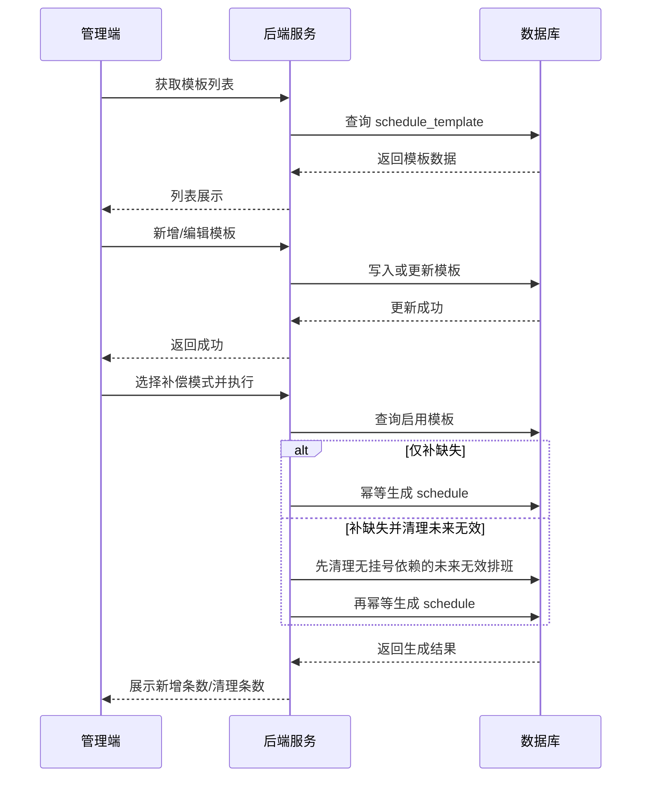

# 第二工期工作内容与图示（排班与挂号阶段）

## 工作内容（详细）
1) 排班模板模型落地与字段细化  
- ScheduleTemplate：医生ID、科室ID、周几、是否上午/下午、号源上限、启用状态、创建/更新时间。  
 - 约束规则：同一医生同一天时段仅保留一条启用模板；停用模板不参与生成。  
 - 实际开发中先试过“字段越少越好”，但联调时发现没有启用状态和号源上限会让模板难以控制,不利于审计，于是把“启用+上限”补回来了。  

2) 排班自动生成与手动补偿机制  
- 生成器策略：按“模板 + 日期范围”批量生成 schedule，生成前检查同日同医生同时段是否已存在，保证幂等。  
- 生成内容：排班日期、时段、号源上限、当前预约数、状态、医生/科室名称快照。  
 - 管理端补偿入口：提供“仅补缺失”和“补缺失并清理未来无效”两种模式；前者用于日常补齐，后者用于模板变更、系统宕机后做一次收敛修正。  
 - 做到这一步时，最怕的是重复生成。模板改动、任务重跑都可能造成重复排班，所以把“幂等检查”放在最前面处理。  

3) 排班查询与号源展示  
- 患者端：按科室/医生筛选排班列表，展示日期、时段、剩余号源。  
- 医生端：不再单独提供排班页，医生侧统一通过挂号列表、接诊列表和问诊房间处理当日业务。  
 - 号源字段：appointmentLimit（总号源）、currentAppointmentCount（已占用）。  
 - 试跑时就遇到“前端显示可挂但后端已满”的情况，后来把号源校验统一放在后端，前端只负责展示。  

4) 挂号创建与状态流转  
- 挂号创建：校验号源、写入 registration、更新 schedule 的已挂号数。  
- 状态流转：已支付(1) → 排队中(2) → 问诊中(3) → 已完成(4)；补充挂起(5)/已回归(6)/等待确认(7)/失效(8)。  
 - 并发控制：创建挂号时进行号源校验，避免超卖。  
 - 初期只跑主链路，结果联调时发现挂起/失效这类边界状态直接影响前端按钮逻辑，于是把状态码补齐并统一解释。  

5) 管理端排班模板管理页面  
- 列表/新增/编辑/启用停用/删除模板；支持按医生筛选。  
 - 直接触发补偿生成，并区分“只补齐缺失排班”和“补齐并清理未来无效排班”，生成结果展示新增条数、清理条数与日期范围。  
 - 实际跑起来发现只靠定时任务没法解释“今天为什么没生成”，补偿按钮和生成结果提示能让问题可复盘。  

6) 接口联调与功能验证  
- 前端联调：模板管理、排班查询、挂号创建与列表展示。  
 - 后端联调：模板生成、幂等校验、挂号与号源计数一致性检查。  
 - 联调阶段暴露的问题主要是字段对不上、状态语义不一致，后来做了一份对照表逐项修正。  

## 图示

### 1. 排班模板生成流程图

### 2. 挂号状态流转图

### 3. 排班与挂号实体关系图（概念级）

### 4. 管理端排班模板管理时序图

