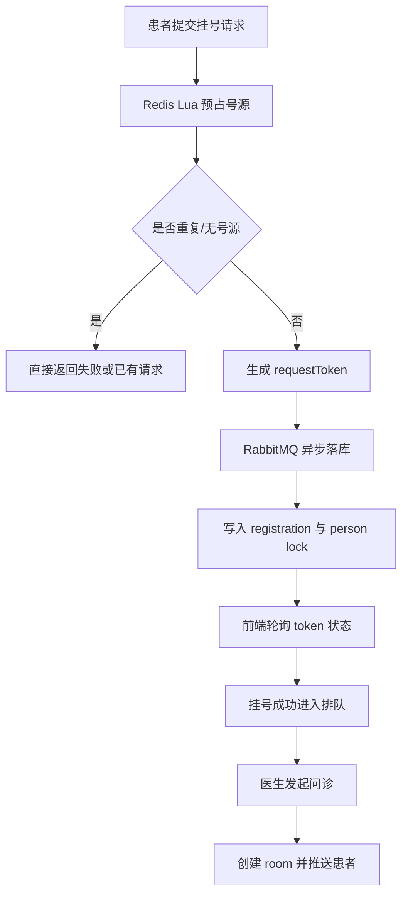
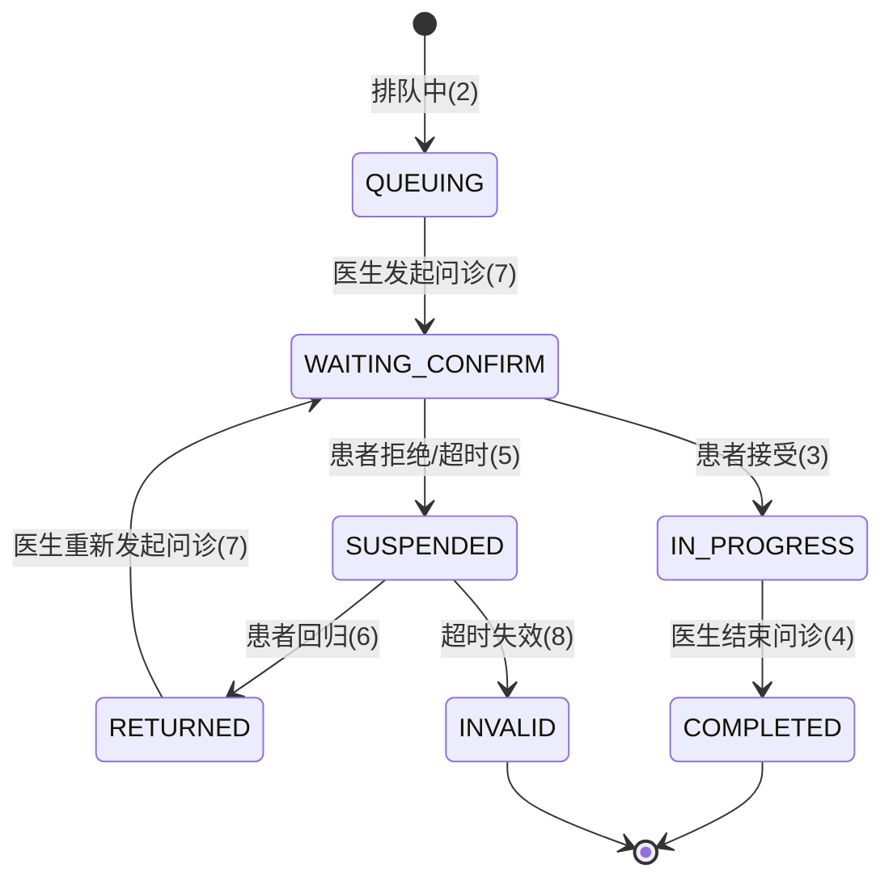
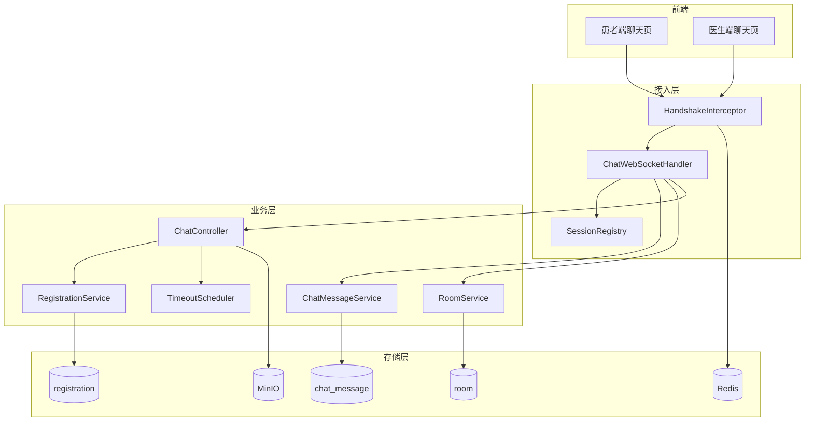
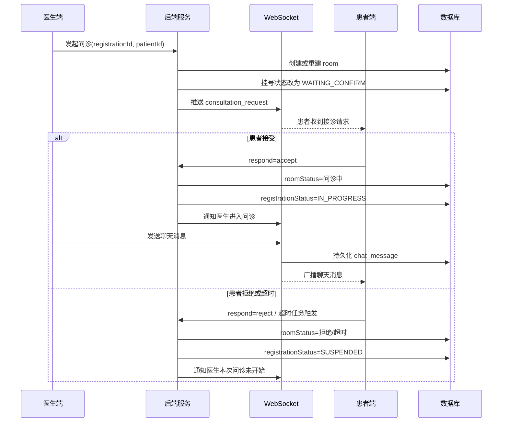

# 第三工期工作内容与图示（问诊与聊天阶段）

## 工作内容（详细）
1) 挂号结果与问诊入口衔接
- 在第三工期开始前，先把第二工期末尾的挂号创建链路重新梳理了一遍。当前挂号不是简单的“点一次按钮直接落库”，而是先走 Redis 预占号源，再返回 `token` 给前端轮询状态，最终由异步消费者完成落库确认。
- 这一版挂号链路补充了 `requestToken`、`personKey` 和 `registration_person_lock`，用来保证“同一个真实就诊人、同一个排班，只能成功占到一个号”。这样做的原因很直接：问诊阶段一旦建立在重复挂号、脏挂号之上，医生端接诊列表就会变得不可靠。
- Redis 预占部分这次做了细化处理：库存扣减、重复提交判定、预占记录写入、过期集合登记，全部放进 Lua 脚本里一次完成。前面试过把这些判断拆散写在 Java 里，但高并发下很容易出现“库存没了但记录没跟上”这种前后不一致的问题。
- 同时增加了过期扫描任务，对超时未完成的预占请求做释放，把号源还回去。这部分虽然属于挂号阶段的优化，但它直接影响第三期“医生看到的排队患者是否真实”，所以在第三期文档里一并记录。

2) WebSocket 长连接统一与房间接入方式收敛
- 第三工期的核心工作是把问诊聊天统一到 Spring 原生 WebSocket 上，连接路径固定为 `ws://host:8080/treat/ws/chat/{roomId}`，长连接通知则复用 `patient_{userId}`、`doctor_{userId}` 这种标识方式。
- 这里做过一次明显的收敛：项目早期同时保留了多套实时实现，联调时最大的问题不是“能不能连上”，而是前端到底该连哪一套、后端通知到底发到哪里。后来把实现收敛成一套以后，问题少了很多。
- 握手阶段补上了 token 校验和用户解析逻辑，认证开启时直接校验 Redis 中的登录态；本地联调关闭认证时，也保留了最基本的 userId 解析，避免出现“连上了但不知道是谁”的假连接。

3) 问诊发起、患者响应与状态流转
- 医生端发起问诊时，后端会按挂号记录创建 `room`，把房间状态设置为“等待患者确认”，并同步把挂号状态推进到 `WAITING_CONFIRM(7)`。这样医生端列表状态、患者端提醒、后端房间状态是连在一起的，不再各管各的。
- 患者接受问诊后，房间状态更新为“问诊中”，挂号状态同步推进到 `IN_PROGRESS(3)`；如果患者拒绝，或者超过等待时间没有响应，则把挂号状态改为挂起，方便后续重新接诊或失效处理。
- 这部分联调时暴露过一个典型问题：房间状态改了，但挂号状态没改，前端列表会出现“房间已经在问诊中，列表却还显示排队中”的错位情况。所以后来把状态推进都收敛到后端统一处理，尽量不让前端自己猜。
- 另外补上了医生重新接诊、等待确认、失效这些边界状态的配套说明和状态码映射，避免第三期只覆盖“患者立刻接受”的理想流程。

4) 聊天消息持久化、广播与图片上传
- 文本消息的处理路径已经统一：消息进入 WebSocket 处理器后先解析类型，再写入 `chat_message`，随后按房间广播给双方；如果是通过 REST 发送消息，也会走同样的持久化和广播逻辑。
- 为了兼容前端实际行为，消息处理里额外接住了 `chat`、`consultation_response`、`room_status_update`、`status`、`ready` 等几类指令。原因不是接口设计有多复杂，而是医生端和患者端在不同阶段发出来的消息形态并不完全一致，后端必须做一次归口。
- 图片消息上传这次没有单独做旁路，仍然复用统一上传组件，文件落到对象存储后再把地址作为消息内容保存。这样病历回看或聊天记录回放时，不需要再做二次转换。
- 前端这边也同步把聊天页里的假数据、模拟回复和写死患者资料清掉了，医生看到的患者姓名、电话、性别、年龄都改成从挂号和病历联表查询出来的真实字段。

5) 超时处理、心跳与稳定性补强
- 问诊等待不是无限期的，这一阶段加上了后端侧的超时调度器。医生发起问诊后开始计时，患者一旦接受、拒绝或问诊结束，就取消对应任务；如果超时未响应，则自动把房间和挂号推进到挂起/取消逻辑。
- 心跳方面保留了 `ping/pong`，主要是为了前端掉线重连时更容易判断连接是否真的还活着。这个功能看起来很小，但没有它时，联调里最难排查的问题就是“页面看着在线，实际上消息已经发不进去了”。
- 这一步做完以后，第三期的重点就从“把聊天跑起来”变成了“让聊天状态在异常情况下也能回收”，包括患者拒绝、医生结束问诊、服务重启后重新进入房间等情况。

6) 前后端联调与第三期实际收口
- 患者端已经按 `token -> 轮询状态 -> SUCCESS 后进入预约列表` 的方式接入新的挂号链路；医生端则以真实挂号记录作为接诊来源，不再从占位数据里临时拼问诊列表。
- 第三工期联调过程中，最常见的问题依旧不是接口 404，而是字段含义不一致。例如医生端发起问诊需要的是系统用户 ID，而病历落库又要保留就诊人 ID，这两个字段早期混用过，后来通过联表补字段和前端明确取值才稳定下来。
- 到这一阶段，问诊主链路已经形成比较完整的闭环：患者挂号成功进入排队，医生发起问诊，患者确认后进入聊天，聊天消息可持久化，医生可结束问诊并进入病历/处方阶段。第三期的收口重点，不再是页面是否存在，而是每一步是否都对应真实状态和真实数据。

## 图示

### 1. 挂号到问诊衔接流程图

### 2. 问诊与房间状态流转图

### 3. WebSocket 聊天模块分层图

### 4. 医生发起问诊与患者确认时序图

